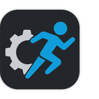

# RigRunner

**RigRunner** is a tool designed to make installing **UMC OS** firmware on your **Antminer** mining rigs fast, easy, and reliable. It guides you through the deployment process so you can get your rigs up and running consistently across multiple devices with minimal effort. RigRunner is production-ready and suitable for both large scale, professional mining and hobbyist setups. It is actively maintained, and updates focus on adding support for additional Antminer models and improving the installation workflow.

Get the latest **RigRunner** software here:

---

## How it works

- **Guided Install:** RigRunner guides you through the install process.  
- **Discovery:** Helps identify compatible Antminer devices on the local network.  
- **Compatibility:** Supports a wide range of Antminer models and ensures proper installation of **UMC OS** on supported devices.  
- **Efficiency:** Install **UMC OS** firmware across multiple rigs and have them up and mining in just minutes.
- **Cross-platform support:** RigRunner works on Windows, macOS, Debian, and Red Hat systems.
- **Uninstallation support:** Allows you to revert rigs back to their stock firmware in their original state.  

---

## Get UMC OS

Get **UMC OS** firmware **here**:

## Compatibility

See supported mining rigs [**here**](https://github.com/epicblockchain/umcos-antminer)

## Demo

